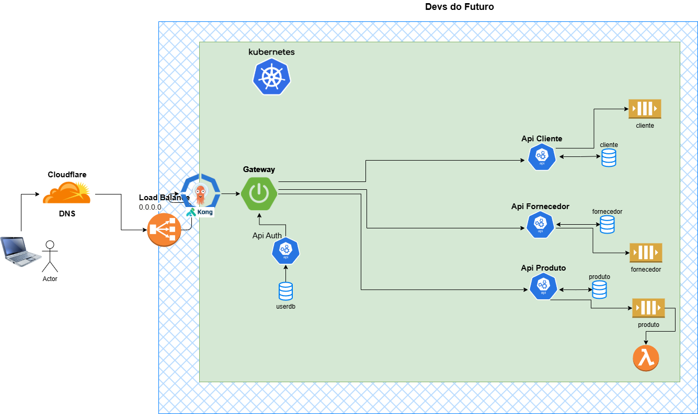

# Gateway Service - Devs do Futuro

[English](README.md) | [Português](README.pt.md)

Gateway service for the Devs do Futuro microservices architecture, built with Spring Cloud Gateway.

## Architecture



## Overview

This gateway service acts as the entry point for our microservices architecture, providing:

- Route management for microservices
- Load balancing
- Authentication/Authorization

## Services Managed

- Customer API (`/customer`) - Port 9002
- Vendor API (`/vendor`) - Port 9001

## Environment Variables

- `PORT` - Gateway port (default: 9000)
- `API_CUSTOMER` - Customer API URL (default: http://localhost:9002)
- `API_VENDOR` - Vendor API URL (default: http://localhost:9001)

## Running with Docker

```bash
cd docker
docker-compose up
```

The service will be available at `http://localhost:9000`

## Development

### Prerequisites

- Java 21
- Maven 3.9+

### Running Locally

```bash
mvn spring-boot:run
```

## Technologies

- Spring Boot 3.4.4
- Spring Cloud Gateway
- Docker
- Kubernetes (deployment ready)
