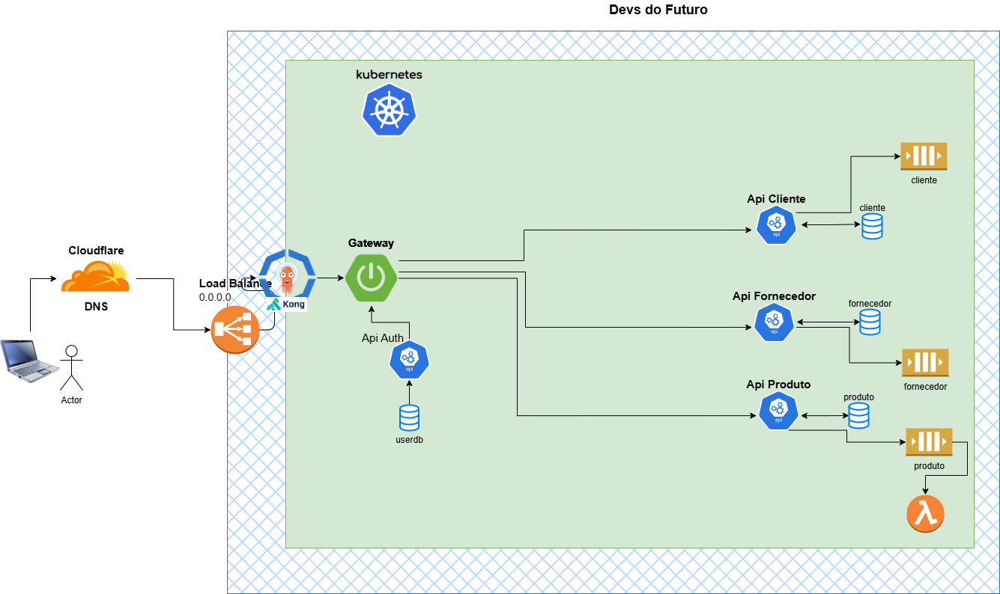

# Serviço Gateway - Devs do Futuro

[English](README.md) | [Português](README.pt.md)

Serviço Gateway para a arquitetura de microsserviços Devs do Futuro, construído com Spring Cloud Gateway.

## Arquitetura



## Visão Geral

Este serviço gateway atua como ponto de entrada para nossa arquitetura de microsserviços, fornecendo:

- Gerenciamento de rotas para microsserviços
- Balanceamento de carga
- Autenticação/Autorização

## Serviços Gerenciados

- API de Cliente (`/customer`) - Porta 9002
- API de Fornecedor (`/vendor`) - Porta 9001

## Variáveis de Ambiente

- `PORT` - Porta do Gateway (padrão: 9000)
- `API_CUSTOMER` - URL da API de Cliente (padrão: http://localhost:9002)
- `API_VENDOR` - URL da API de Fornecedor (padrão: http://localhost:9001)

## Executando com Docker

```bash
cd docker
docker-compose up
```

O serviço estará disponível em `http://localhost:9000`

## Desenvolvimento

### Pré-requisitos

- Java 21
- Maven 3.9+

### Executando Localmente

```bash
mvn spring-boot:run
```

## Tecnologias

- Spring Boot 3.4.4
- Spring Cloud Gateway
- Docker
- Kubernetes (pronto para implantação)
